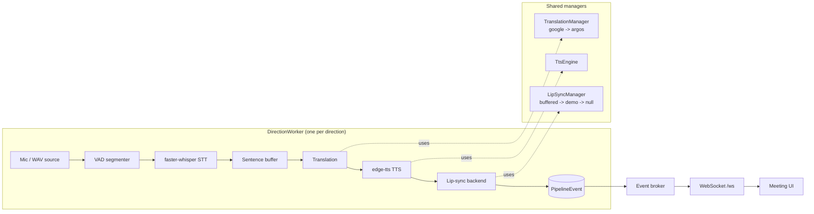

# VoiceBridge AI

Real-time, two-way speech translation with a lip-synced talking-head output.
Speak in one language; the other participant hears it in theirs, spoken by a
synced avatar. Built to run offline-capable on CPU-only hardware, with online
services used as the fast path and local fallbacks when they are unavailable.

## What it does

For each participant in a call, VoiceBridge runs a full pipeline:

```
mic audio -> VAD segmentation -> speech-to-text -> sentence buffer
          -> translation -> text-to-speech -> lip sync -> playback
```

Both directions of a two-way call run **concurrently** — each direction owns
its own STT engine, so neither speaker blocks the other.

## Architecture



Key design points:

- **Config-driven.** Every tunable lives in `config.yaml`, not in Python
  constants. Languages, voices, buffer thresholds, backend order, device
  preference — all editable without touching code.
- **Layered fallbacks.** Translation tries Google (`deep-translator`) then
  offline Argos. Lip sync tries real Wav2Lip, then a pre-rendered demo clip,
  then audio-only passthrough. The pipeline always produces *something*.
- **Honest latency.** Each `speech_ready` event reports measured end-to-end
  latency and whether the output was genuinely lip-synced or a fallback.
- **Thread/async bridge.** Pipeline stages run in plain threads; an event
  broker marshals their events onto the asyncio loop for WebSocket delivery.

### Package layout

| Module | Responsibility |
|---|---|
| `voicebridge.config` | Load `config.yaml`, dotted-path access, path/language helpers |
| `voicebridge.audio` | Capture, Silero VAD segmentation, non-blocking playback |
| `voicebridge.stt` | faster-whisper engine (per-direction) + reliability guards |
| `voicebridge.translation` | Google + Argos backends behind a fallback manager |
| `voicebridge.tts` | edge-tts synthesis |
| `voicebridge.lipsync` | `buffered` / `demo` / `null` backends + fallback manager |
| `voicebridge.pipeline` | Sentence buffer, direction worker, orchestrator, events |
| `voicebridge.api` | FastAPI app, WebSocket broker, meeting UI |

## Setup

Requires Python 3.10+ and **ffmpeg** on your `PATH` (used for audio decoding
and Wav2Lip muxing).

```bash
pip install -r requirements.txt
```

First run downloads the faster-whisper model. For the offline translation
fallback, install the Argos language packages you need, e.g. English<->Arabic:

```python
import argostranslate.package as pkg
pkg.update_package_index()
available = pkg.get_available_packages()
for p in available:
    if (p.from_code, p.to_code) in {("en", "ar"), ("ar", "en")}:
        pkg.install_from_path(p.download())
```

## Run the demo

Start the server:

```bash
python -m voicebridge
# open http://127.0.0.1:8000
```

In the UI, pick your two languages, choose a source, and click **Start call**:

- **Microphone (live)** — a real two-way call using your mic.
- **WAV file (demo)** — feed a prepared clip (e.g. `assets/test_en.wav`) so a
  demo is repeatable without a mic. Runs one direction.

Captions, translations, and synced/audio playback appear per participant, with
a running transcript and per-utterance latency underneath.

## Lip-sync modes

Set `lipsync.backend` in `config.yaml`:

- `demo` — plays a pre-rendered clip from `assets/prerendered/`. Smooth and
  reliable for a live demo; clearly labelled as demo mode.
- `buffered` — real Wav2Lip inference per utterance. Genuine sync, but on CPU
  it is **near-real-time (buffered)**, not truly real-time. Needs a cloned
  Wav2Lip repo (`lipsync.buffered.repo_dir`), its checkpoint, and a source
  face video.
- `null` — audio-only passthrough. Fastest; for iterating on the rest of the
  pipeline.

If the requested backend is unavailable, the manager falls back
`buffered -> demo -> null` automatically.

## Testing

```bash
python -m pytest
```

The suite covers the pure text/buffer logic with a deterministic clock, the
translation/STT reliability guards, and the API surface (info, media URL
rewriting, thread->async broker) without touching audio hardware or loading
models for every test.

## Limitations

- **CPU lip sync is not real-time.** Wav2Lip on CPU renders a few seconds of
  audio in longer than their duration. Use `buffered` for genuine sync at the
  cost of latency, or `demo` for a smooth live presentation.
- **Online translation quality is best.** The offline Argos fallback keeps you
  running without a network but is lower quality than Google.
- **Latency is dominated by STT + TTS.** Expect several seconds per utterance
  end-to-end on CPU; this is reported honestly per event rather than hidden.
- **No authentication.** The server binds to `127.0.0.1` by default and has no
  auth. Do not expose it to a network without adding access control.
"# VoiceBridge-AI" 
