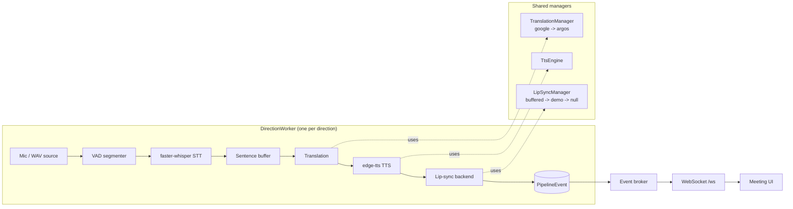
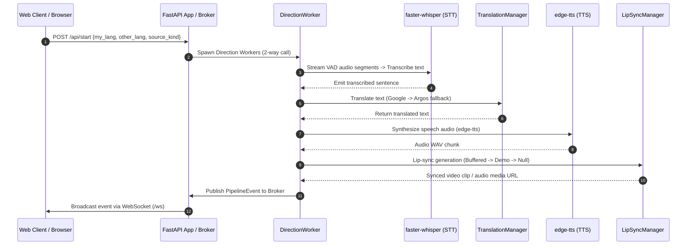

# VoiceBridge AI

Real-time, two-way speech translation with a lip-synced talking-head output.
Speak in one language; the other participant hears it in theirs, spoken by a
synced avatar. Built to run offline-capable on CPU-only hardware, with online
services used as the fast path and local fallbacks when they are unavailable.

## What it does

For each participant in a call, VoiceBridge runs a full pipeline:

```
mic audio -> VAD segmentation -> speech-to-text -> sentence buffer
          -> translation -> text-to-speech -> lip sync -> playback
```

Both directions of a two-way call run **concurrently** — each direction owns
its own STT engine, so neither speaker blocks the other.

## Architecture



Key design points:

- **Config-driven.** Every tunable lives in `config.yaml`, not in Python
  constants. Languages, voices, buffer thresholds, backend order, device
  preference — all editable without touching code.
- **Layered fallbacks.** Translation tries Google (`deep-translator`) then
  offline Argos. Lip sync tries real Wav2Lip, then a pre-rendered demo clip,
  then audio-only passthrough. The pipeline always produces *something*.
- **Honest latency.** Each `speech_ready` event reports measured end-to-end
  latency and whether the output was genuinely lip-synced or a fallback.
- **Thread/async bridge.** Pipeline stages run in plain threads; an event
  broker marshals their events onto the asyncio loop for WebSocket delivery.

### Package layout

| Module | Responsibility |
|---|---|
| `voicebridge.config` | Load `config.yaml`, dotted-path access, path/language helpers |
| `voicebridge.audio` | Capture, Silero VAD segmentation, non-blocking playback |
| `voicebridge.stt` | faster-whisper engine (per-direction) + reliability guards |
| `voicebridge.translation` | Google + Argos backends behind a fallback manager |
| `voicebridge.tts` | edge-tts synthesis |
| `voicebridge.lipsync` | `buffered` / `demo` / `null` backends + fallback manager |
| `voicebridge.pipeline` | Sentence buffer, direction worker, orchestrator, events |
| `voicebridge.api` | FastAPI app, WebSocket broker, meeting UI |

## Setup & Prerequisites

### 1. Prerequisites
- **Python**: 3.11+

- **System Dependencies**: **FFmpeg** must be installed and available on your system `PATH` (required for audio decoding, format conversion, and Wav2Lip video/audio muxing).
  - *Windows*: Install via `winget install FFmpeg` or download from [ffmpeg.org](https://ffmpeg.org/).
  - *Linux*: `sudo apt install ffmpeg`
  - *macOS*: `brew install ffmpeg`

### 2. Environment Setup
Clone the repository and install pinned dependencies:

```bash
git clone https://github.com/aminturabi/VoiceBridge-AI.git
cd VoiceBridge-AI

# Create virtual environment (recommended)
python -m venv venv
# Windows:
.\venv\Scripts\activate
# Linux/macOS:
source venv/bin/activate

# Install runtime & dev dependencies
pip install -r requirements.txt
```

Copy the example environment file to configure your local settings:
```bash
cp .env.example .env
```

### 3. Offline Language Model Setup (Optional)
On first execution, `faster-whisper` downloads the STT model automatically. For offline translation fallbacks using Argos:

```python
import argostranslate.package as pkg
pkg.update_package_index()
available = pkg.get_available_packages()
for p in available:
    if (p.from_code, p.to_code) in {("en", "ar"), ("ar", "en")}:
        pkg.install_from_path(p.download())
```

---

## API Flow & End-to-End Execution Sequence



---

## Running VoiceBridge AI

### Start Web Application & API
```bash
python -m voicebridge
# Application will be accessible at http://127.0.0.1:8000
```

### API Endpoints Overview
| Endpoint | Method | Description |
|---|---|---|
| `/` | `GET` | Two-participant interactive call UI |
| `/api/info` | `GET` | Operational status & loaded configuration |
| `/api/health` | `GET` | Full system health, CPU/RAM stats & provider latency |
| `/api/health/liveness` | `GET` | Liveness check endpoint |
| `/api/health/readiness` | `GET` | Readiness check endpoint |
| `/api/start` | `POST` | Start single-way or two-way translation pipeline |
| `/api/stop` | `POST` | Gracefully stop active pipeline directions |
| `/ws` | `WS` | Real-time WebSocket event stream |

---

## Lip-sync Modes & Hardware Profiles

Set `lipsync.backend` in `config.yaml` or override via environment variables:

- `demo` — Pre-rendered talking-head clip from `assets/prerendered/`. High quality, lightweight, zero GPU requirement.
- `buffered` — Real-time Wav2Lip neural inference. Requires local Wav2Lip repository path (`lipsync.buffered.repo_dir`) and model checkpoint.
- `null` — Pure audio passthrough without video synthesis. Fastest execution mode.

If a requested backend fails or is missing dependencies, the engine auto-degrades gracefully (`buffered -> demo -> null`).

---

## Benchmarking & Performance Monitoring

VoiceBridge AI includes an asynchronous, production-ready benchmarking and hardware monitoring suite:

```bash
# Run automated benchmark suite
python -m voicebridge benchmark

# Launch real-time CLI monitoring dashboard
python -m voicebridge dashboard
```

---

## Testing & Quality Gates

```bash
# Run unit & integration test suite
python -m pytest

# Run tests with coverage output
pytest --cov=voicebridge --cov-report=term-missing

# Code formatting & linting check
ruff check .
black --check .
```

---

## Common Issues & Troubleshooting

### 1. `FileNotFoundError: [WinError 2] The system cannot find the file specified (ffmpeg)`
- **Cause**: FFmpeg executable is not in your environment `PATH`.
- **Solution**: Install FFmpeg and verify by running `ffmpeg -version` in your terminal. On Windows, ensure the directory containing `ffmpeg.exe` is added to System Environment Variables.

### 2. `ArgosTranslate Language Model Missing`
- **Cause**: Offline translation requested without downloading local Argos `.argosmodel` packages.
- **Solution**: Run the Argos package downloader snippet in Section 3 or set `translation.backend: google` in `config.yaml` for online translation.

### 3. `Port 8000 already in use`
- **Cause**: Another process or previous server instance is running on port 8000.
- **Solution**: Pass `HOST` / `PORT` environment variables or stop the occupying process:
  ```bash
  PORT=8080 python -m voicebridge
  ```

### 4. `PyAudio / PortAudio device initialization failed`
- **Cause**: Live microphone capture initialized without a recognized input audio device.
- **Solution**: Check microphone permissions or use `source_kind: "wav"` to run demo WAV audio files without needing physical mic access.
 
