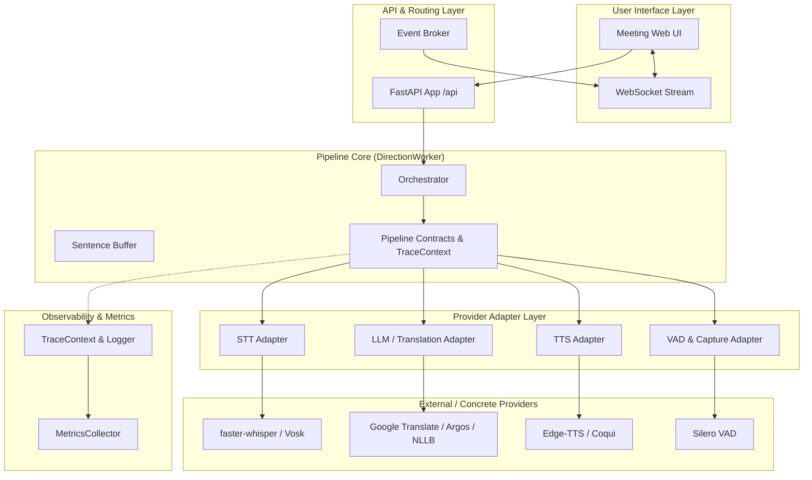
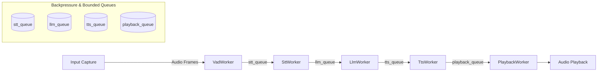
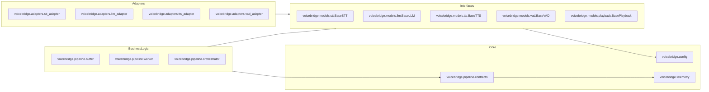

# VoiceBridge AI — System Architecture (Phase 1 Modernization)

## Overview

VoiceBridge AI provides real-time, bi-directional speech translation and lip-synced avatar animation. Phase 1 modernizes the codebase architecture by introducing:

1. **Typed Pipeline Contracts**: Request, response, and error schemas for every stage with mandatory `trace_id` correlation.
2. **Provider Interfaces**: Abstract provider contracts (`BaseSTT`, `BaseLLM`, `BaseTTS`, `BaseVAD`, `BasePlayback`).
3. **Dependency Isolation**: Adapter layer insulating core business logic from specific vendor implementations (Whisper, Google, Argos, NLLB, Edge-TTS, Silero).
4. **Structured Telemetry**: Contextual tracing and metrics export (OpenTelemetry & Prometheus ready).
5. **Centralized Configuration & Feature Flags**: Standardized configuration loader with feature flag toggles (`ENABLE_PIPELINE_CONTRACTS`, `ENABLE_NEW_INTERFACES`, `ENABLE_TRACING`).

---

## Component Architecture

---

## Phase 2 Asynchronous Worker Queue Architecture

Phase 2 connects independent stage workers (`VadWorker`, `SttWorker`, `LlmWorker`, `TtsWorker`, `PlaybackWorker`) using bounded async queues (`BoundedAsyncQueue`). When queues reach capacity under heavy load, backpressure logic compacts partial STT transcripts or evicts oldest items to prevent unbounded memory growth while logging overload events correlated with `trace_id`.

---

## Dependency Graph

---

## SOLID Principles & Clean Architecture

- **Single Responsibility Principle (SRP)**: Each provider interface and adapter has a single concern.
- **Open/Closed Principle (OCP)**: New STT/LLM/TTS backends can be registered via adapters without modifying pipeline orchestration logic.
- **Liskov Substitution Principle (LSP)**: All STT, LLM, and TTS providers conform strictly to `BaseSTT`, `BaseLLM`, `BaseTTS` contracts.
- **Interface Segregation Principle (ISP)**: Interfaces are strictly focused per modality.
- **Dependency Inversion Principle (DIP)**: Pipeline orchestration depends on abstract interfaces (`BaseSTT`, `BaseLLM`, `BaseTTS`), not concrete libraries.
