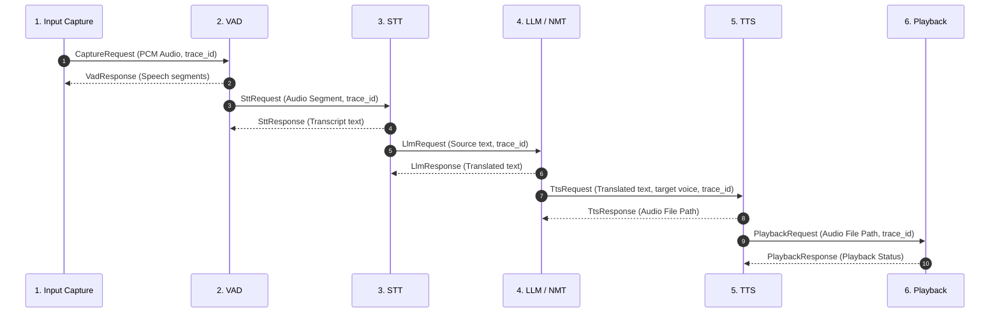

# VoiceBridge AI — Pipeline Architecture & Stages

## Overview

The processing pipeline handles multi-modal transformation of audio input in one language into synthesized, lip-synced audio in another language.

---

## 6 Pipeline Stages

---

## Stage Descriptions & Responsibilities

| Stage | Input Schema | Output Schema | Primary Responsibility | Default Provider |
|---|---|---|---|---|
| **1. Input Capture** | Mic stream / WAV file | `CaptureResponse` | Captures raw PCM audio at 16kHz mono | `sounddevice` / WAV File Reader |
| **2. Voice Activity Detection** | `CaptureResponse` | `VadResponse` | Detects speech boundaries & silences | `Silero VAD` |
| **3. Speech-to-Text (STT)** | `SttRequest` | `SttResponse` | Transcribes audio speech to text | `faster-whisper` |
| **4. LLM / Translation** | `LlmRequest` | `LlmResponse` | Translates / transforms source text to target language | `Google` / `Argos` / `NLLB` |
| **5. Text-to-Speech (TTS)** | `TtsRequest` | `TtsResponse` | Synthesizes translated text into target voice audio | `edge-tts` |
| **6. Playback & Muxing** | `PlaybackRequest` | `PlaybackResponse` | Plays synthesized audio & streams video clip | Audio device / Web UI |

---

## Error Handling & Reliability

Each stage returns an explicit `ErrorSchema` on failure, allowing downstream orchestrators to log trace metrics and execute fallbacks without crashing the application thread.
