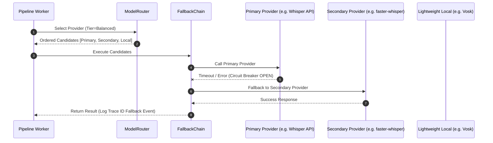

# VoiceBridge AI — Intelligent Model Router & Fallback Strategy

## Overview

The Phase 3 Intelligent Model Router dynamically selects the optimal STT, LLM/Translation, and TTS provider based on language, latency budgets, quality tiers, system CPU/GPU load, and provider health scores.

---

## Quality Tiers & Latency Budgets

| Quality Tier | Latency Budget (ms) | Target Use Case | Example Providers |
|---|---|---|---|
| **Fast** | ≤ 400 ms | Ultra low-latency live calls | `tiny/small whisper`, `google`, `edge-tts` |
| **Balanced** | ≤ 1200 ms | General two-way translation | `medium whisper`, `argos`, `edge-tts` |
| **High Quality** | ≤ 3000 ms | Studio-quality transcription | `large-v3 whisper`, `nllb-200`, `coqui` |

---

## Provider Health & Selection Scoring Formula

$$\text{Score} = \text{HealthScore} - \text{LatencyPenalty}$$

Where:
- $\text{HealthScore} = 1.0 - (0.25 \times \text{Errors}) - \text{CPUPenalty}$
- $\text{LatencyPenalty} = \max\left(0, \frac{\text{AvgLatency} - \text{Budget}}{\text{Budget}}\right) \times 0.5$

The provider with the highest score is selected as primary.

---

## Automatic Fallback Sequence Diagram

